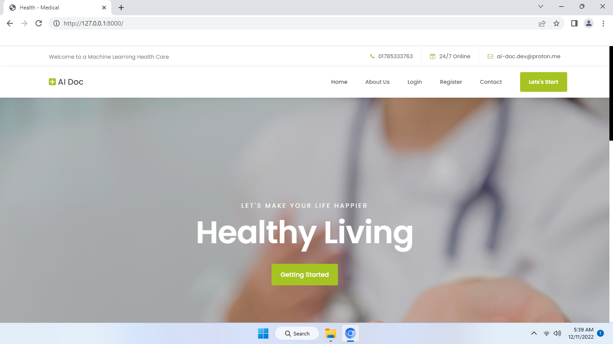

# Web-Based-Self-Healthcare-Using-Machine-Learning
- Developed an intelligent self-healthcare system that leverages machine learning to predict potential diseases based on user-reported symptoms
-  Collaborated with a team of fellow students to design, implement, and test the system throughout the project lifecycle
-  Utilized Django for back-end development, enabling seamless integration with the front-end components built with HTML, CSS, and JavaScript
-  Employed machine learning libraries such as NumPy, Pandas, Scikit-learn, joblib, matplotlib, and seaborn to create, train, and validate the prediction model
- Implemented a user-friendly interface that promotes ease of use and encourages self-monitoring of health conditions
-  Ensured data integrity and security by utilizing the SQLite3 database for efficient storage and retrieval of user data
- Presented the project to faculty members and received positive feedback for its innovative approach, robust functionality, and potential impact on healthcare management

